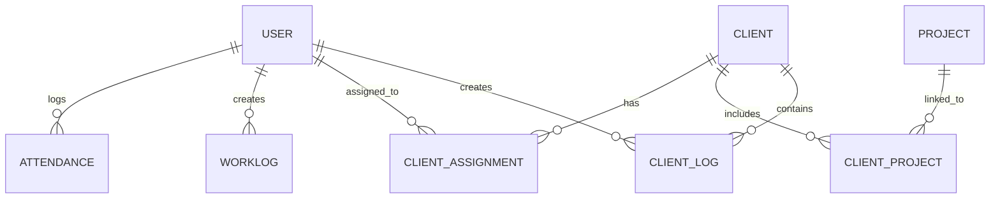
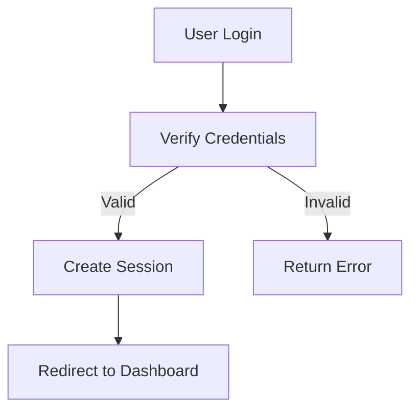
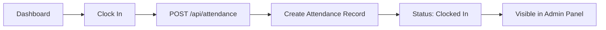
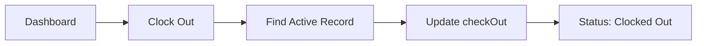
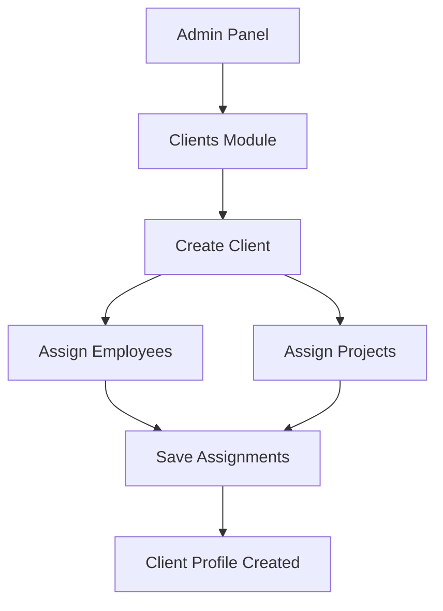
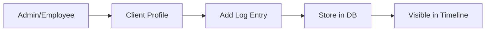

# 🚀 TN.work.proto – Workforce & Client Operations System

A full-stack workforce management and client operations platform designed for internal studio operations.

**Developer:** Kunal Daharwal
**Tech Stack:** Next.js (App Router), TypeScript, Prisma, PostgreSQL, TailwindCSS
**Designed for:** Studio Admins & Internal Employees

---

## 📌 Project Overview

`TN.work.proto` is an internal operations system built to streamline:

* Employee attendance & work hours
* Work logs & daily reporting
* Admin attendance dashboard
* Error logs & notices
* **Client management**
* **Client logs & audit trails**
* **Employee assignments per client**
* **Client + employee + attendance PDF exports**

The system implements strict **role-based access**:

* **Admin:** Full access to all modules
* **Employee:** Personal dashboard, attendance, and work logs

---

## 🧩 Core Modules

### 1. 🔐 Authentication

Secure login, logout, and session validation with role enforcement.

### 2. 🕒 Attendance Tracking

Clock-in / Clock-out workflow, employee time calculation, and admin monitoring.

### 3. 🧾 Work Log System

Employees log daily work with timestamps.

### 4. 👥 Employee Management (Admin)

Create, update, delete employees and export employee reports.

### 5. 🏢 Client & Project Management

Admins can manage:

* Clients
* Projects
* Multi-employee assignment
* Client logs / activity history
* Exportable client reports

---

## 🗄️ Database Relationships (High-Level)

Key entities:

* `User`
* `Attendance`
* `WorkLog`
* `Notice`
* `ErrorLog`
* `Project`
* `Client`
* `ClientAssignment`
* `ClientProject`
* `ClientLog`

---

## 🔄 Authentication Flow

---

## 🔄 Attendance Flow (Employee)

### Clock In

### Clock Out

---

## 🔄 Client Management Flow

---

## 🔄 Client Logs Flow

---

# 📘 API Documentation

A complete reference for backend API endpoints.

---

## 🔐 Authentication

| Method | Endpoint            | Description                         |
| ------ | ------------------- | ----------------------------------- |
| POST   | `/api/auth/login`   | Login with employee code & passcode |
| POST   | `/api/auth/logout`  | Logout & destroy session            |
| GET    | `/api/auth/session` | Get current authenticated user      |

---

## 🕒 Attendance

### Employee Attendance

| Method | Endpoint                     | Description             |
| ------ | ---------------------------- | ----------------------- |
| POST   | `/api/attendance`            | Clock In / Clock Out    |
| GET    | `/api/attendance/status`     | Current in/out status   |
| GET    | `/api/attendance/today`      | Today’s hours           |
| GET    | `/api/attendance/weekly`     | Weekly breakdown        |
| GET    | `/api/attendance/monthly`    | Monthly summary         |
| GET    | `/api/attendance/export/pdf` | Export attendance (PDF) |
| GET    | `/api/attendance/export/csv` | Export attendance (CSV) |

### Admin Attendance

| Method | Endpoint                     | Description                |
| ------ | ---------------------------- | -------------------------- |
| GET    | `/api/attendance/admin`      | All employees’ attendance  |
| GET    | `/api/admin/attendance/live` | Live admin attendance feed |

---

## 👥 Employee Management (Admin)

| Method | Endpoint                         | Description                   |
| ------ | -------------------------------- | ----------------------------- |
| POST   | `/api/admin/create-user`         | Create employee               |
| POST   | `/api/admin/delete-user`         | Delete employee               |
| GET    | `/api/employees`                 | List all employees            |
| GET    | `/api/admin/employee/:id/export` | Export employee profile (PDF) |

---

## 🧾 Clients & Projects

### Projects

| Method | Endpoint           | Description                |
| ------ | ------------------ | -------------------------- |
| GET    | `/api/allprojects` | List all internal projects |

### Client Management (Admin Only)

| Method | Endpoint                        | Description                 |
| ------ | ------------------------------- | --------------------------- |
| GET    | `/api/admin/clients`            | List / filter clients       |
| POST   | `/api/admin/clients`            | Create a new client         |
| PATCH  | `/api/admin/clients/:id`        | Update client details       |
| POST   | `/api/admin/clients/:id/assign` | Assign employees            |
| POST   | `/api/admin/clients/:id/logs`   | Add log entry               |
| GET    | `/api/admin/clients/:id/logs`   | View client logs            |
| GET    | `/api/admin/clients/:id/export` | Export client profile (PDF) |
| GET    | `/api/admin/clients/export-all` | Export all client profiles  |

---

# 📄 PDF Export System

PDFs generated using **pdf-lib** and streamed directly to the browser.

### Supported Exports:

* ✔ Client profile
* ✔ All clients (bulk export)
* ✔ Attendance report
* ✔ Employee report

### PDF Includes:

* Client details
* Assigned employees
* Linked projects
* Full logs history

---

## 👤 Roles & Permissions

| Feature               | Admin | Employee |
| --------------------- | :---: | :------: |
| Dashboard             |   ✅   |     ✅    |
| Clock In / Out        |   ❌   |     ✅    |
| Submit Work Logs      |   ❌   |     ✅    |
| Manage Employees      |   ✅   |     ❌    |
| Manage Clients        |   ✅   |     ❌    |
| Assign Employees      |   ✅   |     ❌    |
| View Client Logs      |   ✅   |     ❌    |
| Export PDFs           |   ✅   |     ❌    |
| Attendance Monitoring |   ✅   |     ❌    |
| Create Notices        |   ✅   |     ❌    |

---

# 🔮 Future Enhancements

Planned next:

* Real-time WebSocket attendance board
* Cloudinary file storage for client contracts/assets
* Time-zone–aware reports
* Revenue & billing analytics
* AI-powered summaries for:

  * Client logs
  * Employee work logs
  * Attendance anomalies

---

# 🧠 Built & Designed By

**Kunal Daharwal**
Web Developer (MERN) & Machine Learning Engineer
Project: **TN.work.proto** (2025)

---

